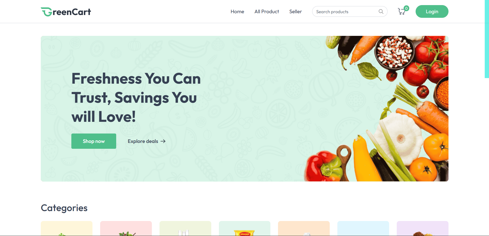
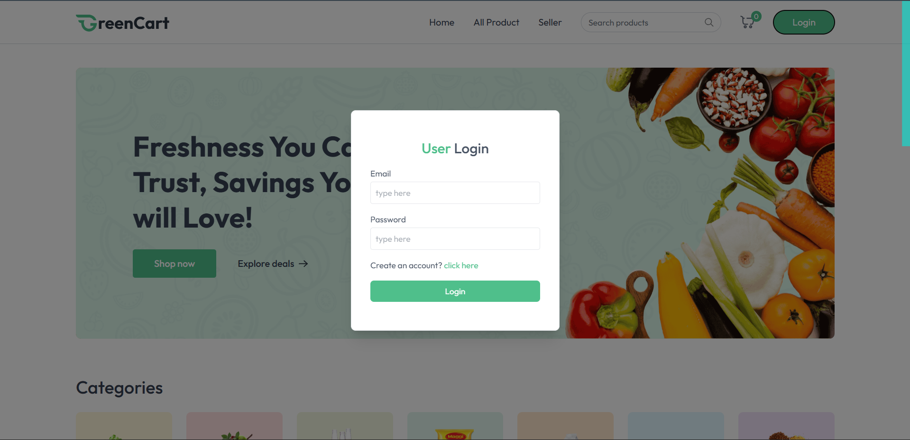
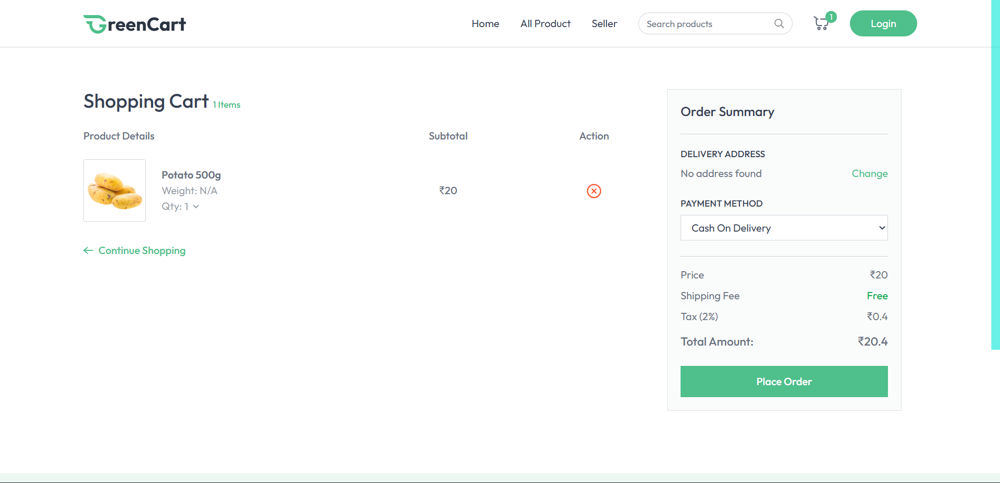
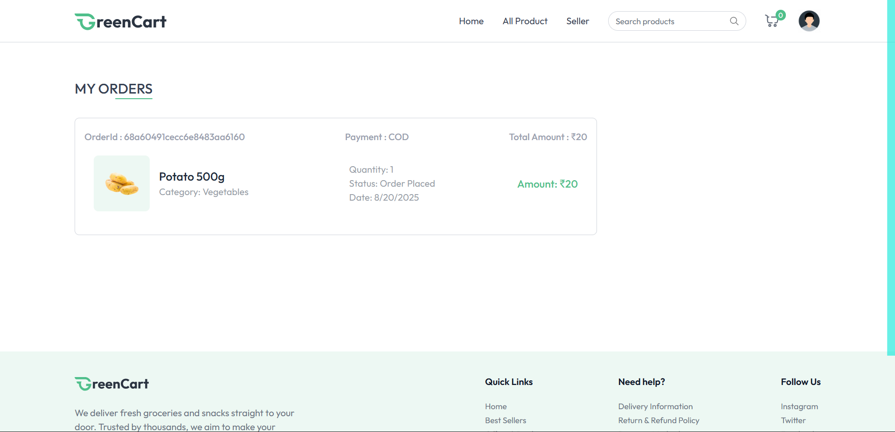

# 🥗 GreenCart – Food Delivery App

A full-stack food delivery platform that allows users to browse food items, add them to their cart, place orders, and pay securely online. The app also includes an admin panel to manage menu items and track customer orders.

🔗 **Live Demo:** [GreenCart](https://green-cart-mern-9py3.vercel.app/)

---

## 🛠 Tech Stack

### Frontend:

* React.js
* React Router
* Axios
* React Context API
* Tailwind CSS

### Backend:

* Node.js
* Express.js
* MongoDB (with Mongoose)
* MongoDB Atlas
* JSON Web Tokens (JWT) for authentication
* Stripe for payments

---

## 🚀 Features

### 🔐 Authentication & Authorization

* Secure JWT-based authentication
* Cookie-based session handling for persistent login
* Protected routes using Express middleware
* Global auth state with React Context API

### 👥 User Functionality

* User registration and login
* Save and manage delivery addresses
* Browse menu items with a responsive UI
* Add/remove food items from the cart in real-time
* Secure checkout with Stripe payment gateway
* View personal order history and statuses

### 👨‍🍳 Admin Functionality

* Add, update, and remove menu items
* Manage customer orders with payment status
* Access a dedicated admin dashboard

### 🌐 General Features

* Clean and responsive UI with Tailwind CSS
* Real-time feedback using toast notifications
* Form validations for authentication and checkout
* Automatic cart clearance after successful payment

---

## 📸 Screenshots

* **Homepage** – show the list of food items displayed to users.
* **User Login / Signup** – capture the authentication page.
* **Cart Page** – show items added to the cart with quantity and total price.
* **Order History** – show past orders with payment status.

```
  
  
  
  
```

---

## 📁 Folder Structure

```
client/       // React frontend  
server/       // Node.js backend  
models/       // Mongoose models  
routes/       // Express route handlers  
middleware/   // Auth and validation middlewares  
controllers/  // Business logic for routes  
```

---

## 🧪 To Run Locally

```bash
# Clone the repository
git clone https://github.com/your-username/greencart.git  

# Navigate to client and server folders to install dependencies
cd client && npm install  
cd ../server && npm install  

# Set up environment variables in server/.env
MONGO_URI=your_mongodb_connection_string
JWT_SECRET=your_secret_key
STRIPE_SECRET_KEY=your_stripe_secret_key
STRIPE_WEBHOOK_SECRET=your_webhook_secret
NODE_ENV=development  

# Start backend
cd server
npm run dev  

# Start frontend
cd ../client
npm start
```

* Backend runs on: `http://localhost:5000`
* Frontend runs on: `http://localhost:3000`
